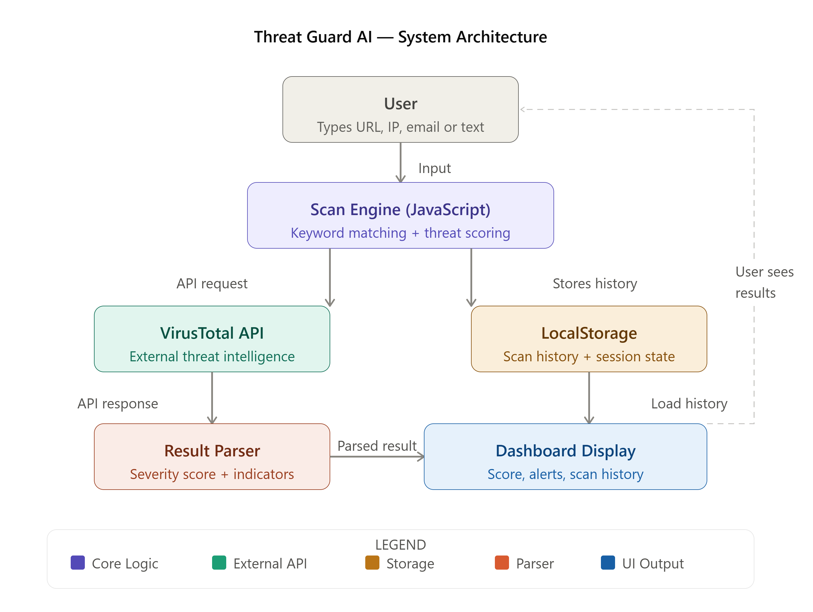

# Threat Guard AI

## Problem Statement
Cyber threats like phishing links, malware, and suspicious IPs spread rapidly through emails and server logs. Users lack a quick, accessible tool to scan and assess threat severity in real time.

## Solution Overview
Threat Guard AI is a browser-based cybersecurity dashboard that lets users scan text, URLs, IPs, and email content for threats. It gives an instant severity score (LOW / MEDIUM / HIGH / CRITICAL) with matched threat indicators and recommended actions.

## Technologies Used
- HTML5, CSS3, JavaScript (Vanilla)
- LocalStorage for session state
- External API: VirusTotal API (threat intelligence)

## Architecture Diagram

## Setup Instructions
1. Clone or download this repository
2. Open `Thread Guard AI.html` in any modern browser
3. No installation required

## Team Members
- Mayank Mishra
- Namya Gupta
- Shalesh Pandey
- Md Toufik Karim
